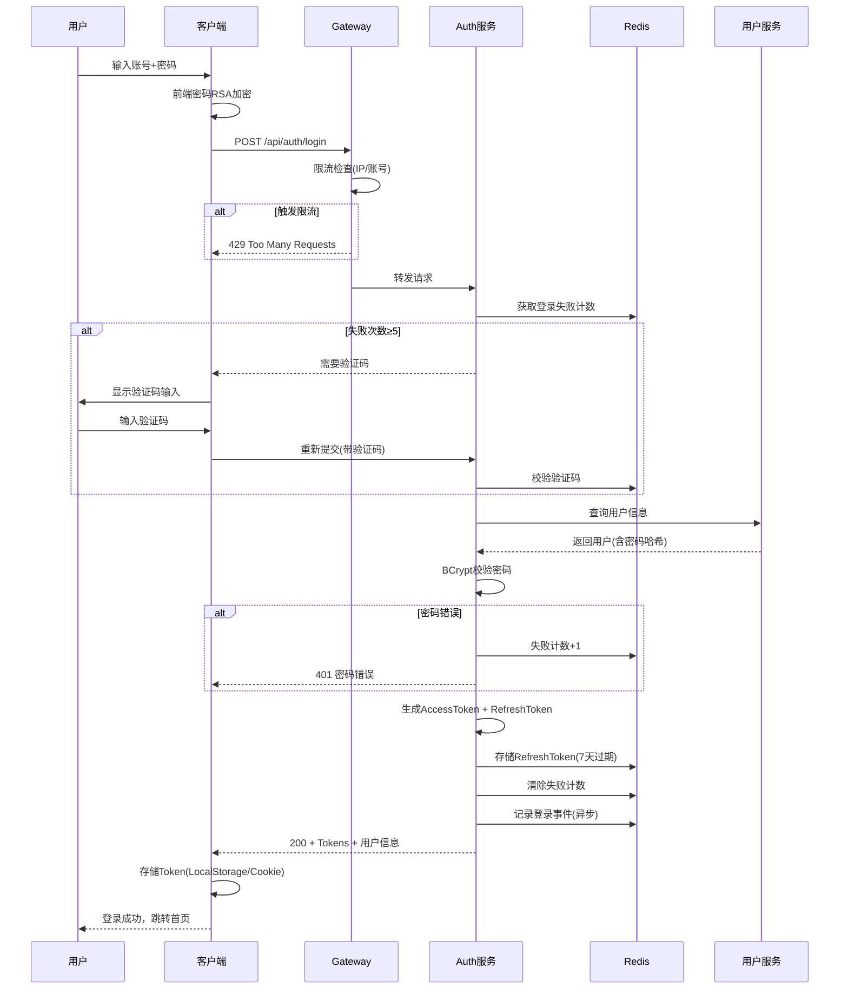
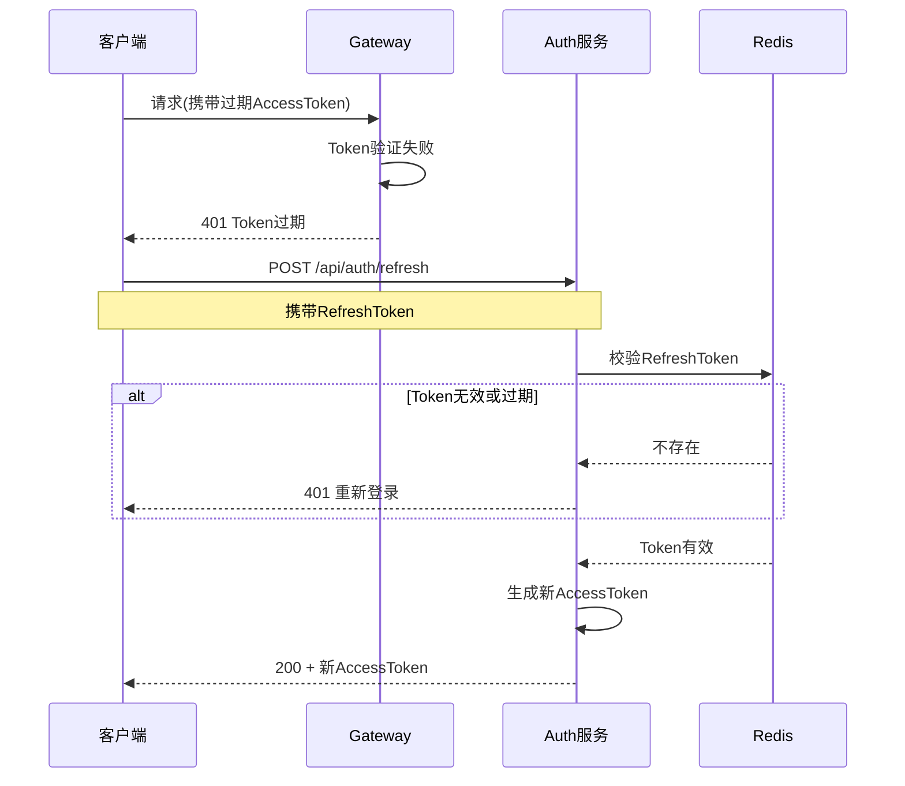
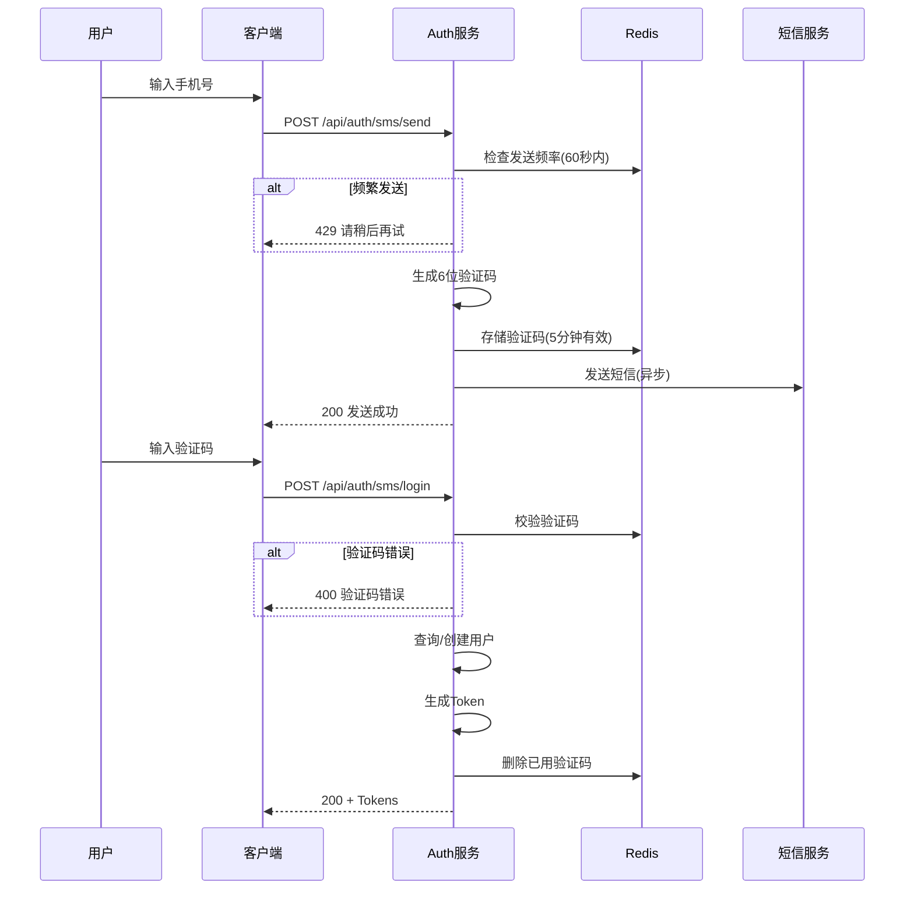

# 用户登录系统设计文档

> **创建日期**：2026-04-01  
> **文档类型**：Design Document  
> **版本**：v1.0  
> **作者**：AI Assistant

---

## 1. 需求概述

### 1.1 业务场景
用户登录是系统的核心入口功能，需要支持多种登录方式，确保安全性与用户体验的平衡。

### 1.2 功能范围
| 功能模块 | 说明 | 优先级 |
|---------|------|-------|
| 账号密码登录 | 基础登录方式，支持邮箱/手机号+密码 | P0 |
| 短信验证码登录 | 免密码快速登录 | P0 |
| 第三方登录 | 微信/QQ/钉钉等OAuth登录 | P1 |
| 扫码登录 | 移动端扫码PC端登录 | P1 |
| 单点登录(SSO) | 多系统统一认证 | P2 |
| 登录安全策略 | 验证码、限流、异地登录提醒 | P0 |

---

## 2. 系统架构

### 2.1 整体架构

```
┌─────────────────────────────────────────────────────────────┐
│                        客户端层                              │
│  ┌─────────┐  ┌─────────┐  ┌─────────┐  ┌─────────────────┐ │
│  │ Web端   │  │ App端   │  │ 小程序  │  │ 第三方应用      │ │
│  └────┬────┘  └────┬────┘  └────┬────┘  └────────┬────────┘ │
└───────┼────────────┼────────────┼────────────────┼──────────┘
        │            │            │                │
        └────────────┴────────────┴────────────────┘
                          │
                          ▼
┌─────────────────────────────────────────────────────────────┐
│                      接入层 (Gateway)                        │
│  • HTTPS 统一入口    • 限流防刷    • 负载均衡    • 日志记录  │
└─────────────────────────────────────────────────────────────┘
                          │
                          ▼
┌─────────────────────────────────────────────────────────────┐
│                      认证服务层 (Auth Service)               │
│  ┌─────────────┐  ┌─────────────┐  ┌─────────────────────┐  │
│  │ 登录服务    │  │ Token服务   │  │ 安全策略服务        │  │
│  │ • 身份校验  │  │ • JWT签发   │  │ • 限流控制          │  │
│  │ • 密码验证  │  │ • Token刷新 │  │ • 风险检测          │  │
│  │ • 多因子认证│  │ • Token吊销 │  │ • 登录审计          │  │
│  └─────────────┘  └─────────────┘  └─────────────────────┘  │
└─────────────────────────────────────────────────────────────┘
                          │
        ┌─────────────────┼─────────────────┐
        ▼                 ▼                 ▼
┌───────────────┐  ┌───────────────┐  ┌───────────────┐
│   用户服务     │  │   缓存层       │  │   消息队列     │
│  (User Service)│  │  (Redis)      │  │  (Kafka/RMQ)  │
│ • 用户信息查询 │  │ • Session存储 │  │ • 登录事件     │
│ • 密码管理    │  │ • 限流计数    │  │ • 安全告警     │
│ • 账号状态    │  │ • 验证码缓存  │  │ • 审计日志     │
└───────────────┘  └───────────────┘  └───────────────┘
        │
        ▼
┌─────────────────────────────────────────────┐
│              数据存储层                      │
│  ┌───────────────┐  ┌───────────────────┐  │
│  │  MySQL        │  │  Elasticsearch    │  │
│  │  用户主库     │  │  登录日志检索     │  │
│  └───────────────┘  └───────────────────┘  │
└─────────────────────────────────────────────┘
```

### 2.2 模块职责

| 模块 | 职责 | 关键技术 |
|------|------|---------|
| Gateway | 统一入口、限流、日志 | Nginx / Kong / Spring Gateway |
| Auth Service | 核心认证逻辑 | Spring Security / JWT |
| User Service | 用户数据管理 | CRUD、加密存储 |
| Redis | 分布式会话、限流计数、验证码 | Redisson / Lettuce |
| Message Queue | 异步处理登录事件 | Kafka / RabbitMQ |

---

## 3. 登录流程设计

### 3.1 账号密码登录流程



### 3.2 Token刷新流程



### 3.3 短信验证码登录流程



---

## 4. 安全设计

### 4.1 密码安全

| 措施 | 实现方式 | 说明 |
|------|---------|------|
| 传输加密 | RSA + HTTPS | 前端用公钥加密，服务端私钥解密 |
| 存储加密 | BCrypt (cost=12) | 不可逆哈希，支持密码版本升级 |
| 密码策略 | 正则校验 | 8-20位，至少包含大小写+数字 |
| 历史密码 | 记录最近5次 | 禁止重复使用 |

```javascript
// 密码强度正则
const PASSWORD_REGEX = /^(?=.*[a-z])(?=.*[A-Z])(?=.*\d)[a-zA-Z\d@$!%*?&]{8,20}$/;

// BCrypt加密示例（Java）
String hashed = BCrypt.hashpw(plainPassword, BCrypt.gensalt(12));
boolean match = BCrypt.checkpw(plainPassword, hashed);
```

### 4.2 Token机制

| Token类型 | 有效期 | 存储位置 | 用途 |
|----------|--------|---------|------|
| AccessToken | 2小时 | 内存/LocalStorage | 接口鉴权 |
| RefreshToken | 7天 | HttpOnly Cookie | 刷新AccessToken |
| 临时Token | 5分钟 | 一次性 | 敏感操作确认 |

```javascript
// JWT Payload结构
{
  "sub": "user_id_123",      // 用户ID
  "iat": 1711958400,          // 签发时间
  "exp": 1711965600,          // 过期时间(2h)
  "jti": "uuid_token_id",     // Token唯一ID(用于吊销)
  "roles": ["user"],          // 角色
  "type": "access"            // Token类型
}
```

### 4.3 安全防护策略

| 威胁 | 防护措施 | 实现 |
|------|---------|------|
| 暴力破解 | 登录失败限流 | 同一账号5次失败需验证码，15次锁定1小时 |
| 短信轰炸 | 短信发送限流 | 同一手机号60秒内只能发1次，日限10条 |
| 中间人攻击 | HTTPS全站 | TLS 1.3，HSTS头部 |
| XSS攻击 | Cookie安全标记 | HttpOnly, Secure, SameSite=Strict |
| CSRF攻击 | Token机制 | 不使用Cookie自动携带的Session |
| 重放攻击 | 请求时间戳+签名 | 请求头携带ts参数，超时拒绝 |

```yaml
# 限流配置示例
rate-limiter:
  login-by-ip:
    limit: 10           # 每IP每分钟10次
    window: 60s
  login-by-account:
    limit: 5            # 每账号每分钟5次
    window: 60s
  sms-send:
    limit: 1            # 每手机号60秒1次
    window: 60s
    daily-limit: 10     # 日限10条
```

### 4.4 登录风险检测

触发二次验证或阻断的场景：

| 风险类型 | 检测规则 | 处理措施 |
|---------|---------|---------|
| 异地登录 | IP地理位置变化 | 短信验证身份 |
| 异常设备 | 新设备首次登录 | 邮件/短信通知 |
| 异常时间 | 凌晨非常用时段 | 增加验证码难度 |
| 可疑IP | IP黑名单/代理检测 | 阻断+记录日志 |
| 频繁失败 | 短时间多次错误 | 账号临时锁定 |

---

## 5. 接口设计

### 5.1 接口列表

| 接口 | 方法 | 说明 | 鉴权 |
|------|------|------|------|
| `/api/auth/login` | POST | 账号密码登录 | 否 |
| `/api/auth/logout` | POST | 用户登出 | 是 |
| `/api/auth/refresh` | POST | 刷新Token | 否(需RefreshToken) |
| `/api/auth/sms/send` | POST | 发送短信验证码 | 否 |
| `/api/auth/sms/login` | POST | 短信验证码登录 | 否 |
| `/api/auth/captcha` | GET | 获取图形验证码 | 否 |
| `/api/auth/password/reset` | POST | 重置密码 | 是 |

### 5.2 核心接口详情

#### 5.2.1 账号密码登录

```http
POST /api/auth/login
Content-Type: application/json
X-Request-ID: uuid

{
  "account": "user@example.com",
  "password": "RSA_Encrypted_Password",
  "captcha": "",           // 可选，触发风控时必填
  "captchaKey": "",        // 验证码标识
  "deviceId": "device_uuid",
  "platform": "web"        // web/ios/android/miniapp
}
```

**成功响应 200:**
```json
{
  "code": 0,
  "data": {
    "accessToken": "eyJhbGciOiJSUzI1NiIs...",
    "refreshToken": "eyJhbGciOiJSUzI1NiIs...",
    "expiresIn": 7200,
    "tokenType": "Bearer",
    "user": {
      "id": "user_123",
      "nickname": "张三",
      "avatar": "https://...",
      "email": "user@example.com",
      "phone": "138****8888"
    }
  }
}
```

**错误响应:**
```json
{
  "code": 10001,
  "message": "账号或密码错误",
  "data": {
    "remainingAttempts": 3,
    "needCaptcha": true
  }
}
```

#### 5.2.2 Token刷新

```http
POST /api/auth/refresh
Content-Type: application/json
Cookie: refresh_token=xxx

{
  "deviceId": "device_uuid"
}
```

### 5.3 错误码定义

| 错误码 | 说明 | HTTP状态码 |
|-------|------|-----------|
| 0 | 成功 | 200 |
| 10001 | 账号或密码错误 | 401 |
| 10002 | Token无效或过期 | 401 |
| 10003 | 账号已锁定 | 403 |
| 10004 | 需要验证码 | 400 |
| 10005 | 验证码错误 | 400 |
| 10006 | 发送频率过快 | 429 |
| 10007 | 账号不存在 | 404 |
| 10008 | 密码格式错误 | 400 |
| 10009 | 异地登录需验证 | 403 |
| 99999 | 系统错误 | 500 |

---

## 6. 数据库设计

### 6.1 用户表 (user)

```sql
CREATE TABLE `user` (
  `id`              BIGINT UNSIGNED     NOT NULL AUTO_INCREMENT COMMENT '用户ID',
  `uuid`            VARCHAR(32)         NOT NULL COMMENT '用户唯一标识',
  `nickname`        VARCHAR(50)         NOT NULL DEFAULT '' COMMENT '昵称',
  `avatar`          VARCHAR(500)        NOT NULL DEFAULT '' COMMENT '头像URL',
  `email`           VARCHAR(100)                DEFAULT NULL COMMENT '邮箱',
  `phone`           VARCHAR(20)                 DEFAULT NULL COMMENT '手机号',
  `password_hash`   VARCHAR(100)        NOT NULL COMMENT '密码哈希(BCrypt)',
  `password_version` INT                NOT NULL DEFAULT 1 COMMENT '密码版本',
  `status`          TINYINT             NOT NULL DEFAULT 1 COMMENT '状态:0禁用 1正常',
  `created_at`      TIMESTAMP           NOT NULL DEFAULT CURRENT_TIMESTAMP,
  `updated_at`      TIMESTAMP           NOT NULL DEFAULT CURRENT_TIMESTAMP ON UPDATE CURRENT_TIMESTAMP,
  `last_login_at`   TIMESTAMP           NULL COMMENT '最后登录时间',
  PRIMARY KEY (`id`),
  UNIQUE KEY `uk_uuid` (`uuid`),
  UNIQUE KEY `uk_email` (`email`),
  UNIQUE KEY `uk_phone` (`phone`),
  KEY `idx_status_created` (`status`, `created_at`)
) ENGINE=InnoDB DEFAULT CHARSET=utf8mb4 COMMENT='用户表';
```

### 6.2 登录日志表 (login_log)

```sql
CREATE TABLE `login_log` (
  `id`              BIGINT UNSIGNED     NOT NULL AUTO_INCREMENT,
  `user_id`         BIGINT UNSIGNED     NOT NULL COMMENT '用户ID',
  `login_type`      TINYINT             NOT NULL COMMENT '登录类型:1密码 2短信 3微信',
  `ip`              VARCHAR(40)         NOT NULL COMMENT '登录IP',
  `ip_region`       VARCHAR(100)        NOT NULL DEFAULT '' COMMENT 'IP地区',
  `user_agent`      VARCHAR(500)        NOT NULL DEFAULT '' COMMENT 'UA',
  `device_id`       VARCHAR(64)         NOT NULL DEFAULT '' COMMENT '设备ID',
  `platform`        VARCHAR(20)         NOT NULL DEFAULT '' COMMENT '平台',
  `status`          TINYINT             NOT NULL COMMENT '状态:0失败 1成功',
  `fail_reason`     VARCHAR(200)                DEFAULT NULL COMMENT '失败原因',
  `created_at`      TIMESTAMP           NOT NULL DEFAULT CURRENT_TIMESTAMP,
  PRIMARY KEY (`id`),
  KEY `idx_user_id` (`user_id`),
  KEY `idx_created_at` (`created_at`),
  KEY `idx_ip` (`ip`)
) ENGINE=InnoDB DEFAULT CHARSET=utf8mb4 COMMENT='登录日志表';
```

### 6.3 用户密码历史表 (user_password_history)

```sql
CREATE TABLE `user_password_history` (
  `id`              BIGINT UNSIGNED     NOT NULL AUTO_INCREMENT,
  `user_id`         BIGINT UNSIGNED     NOT NULL,
  `password_hash`   VARCHAR(100)        NOT NULL,
  `created_at`      TIMESTAMP           NOT NULL DEFAULT CURRENT_TIMESTAMP,
  PRIMARY KEY (`id`),
  KEY `idx_user_id` (`user_id`, `created_at`)
) ENGINE=InnoDB DEFAULT CHARSET=utf8mb4 COMMENT='密码历史表';
```

---

## 7. 部署与运维

### 7.1 配置项

```yaml
auth:
  jwt:
    secret-key: ${JWT_SECRET}           # 256位密钥
    access-token-expire: 2h
    refresh-token-expire: 7d
    issuer: "your-app-name"
  
  password:
    bcrypt-cost: 12
    max-fail-attempts: 5
    lock-duration: 1h
    history-count: 5
  
  security:
    enable-ip-limit: true
    enable-device-check: true
    enable-geo-check: true
    cors-origins: ["https://your-domain.com"]
```

### 7.2 监控指标

| 指标 | 说明 | 告警阈值 |
|------|------|---------|
| `login_success_rate` | 登录成功率 | < 90% |
| `login_qps` | 登录QPS | - |
| `token_refresh_rate` | Token刷新率 | - |
| `sms_send_fail_rate` | 短信发送失败率 | > 5% |
| `brute_force_blocked` | 暴力破解拦截数 | - |

### 7.3 日志规范

```json
{
  "timestamp": "2026-04-01T12:00:00Z",
  "level": "INFO",
  "traceId": "xxx",
  "event": "USER_LOGIN",
  "userId": "user_123",
  "result": "SUCCESS",
  "metadata": {
    "ip": "192.168.1.1",
    "deviceId": "xxx",
    "loginType": "PASSWORD",
    "duration": 150
  }
}
```

---

## 8. 附录

### 8.1 参考文档
- [OAuth 2.0](https://oauth.net/2/)
- [JWT RFC7519](https://tools.ietf.org/html/rfc7519)
- [OWASP Authentication Cheat Sheet](https://cheatsheetseries.owasp.org/cheatsheets/Authentication_Cheat_Sheet.html)

### 8.2 修订记录

| 版本 | 日期 | 修订内容 | 作者 |
|------|------|---------|------|
| v1.0 | 2026-04-01 | 初始版本 | AI Assistant |

---

**文档结束**
